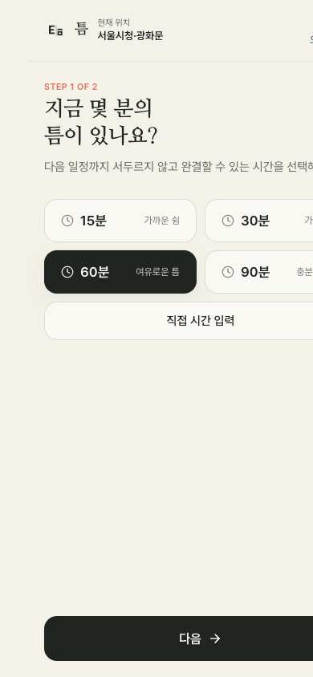
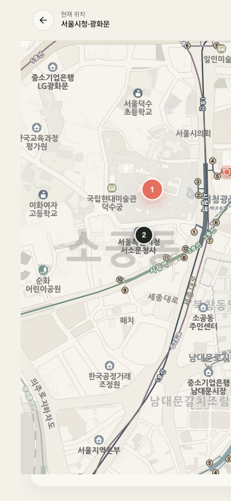
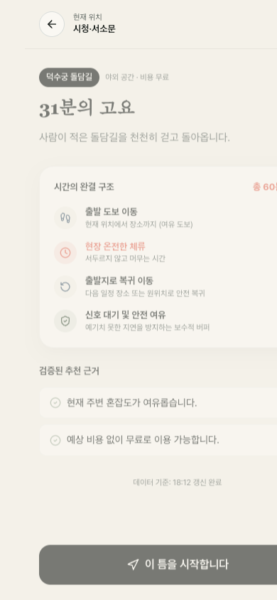
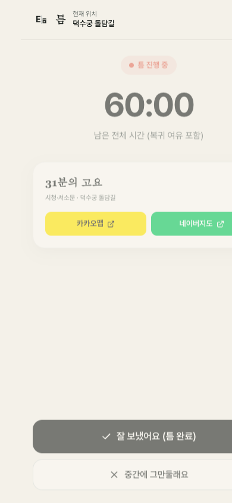

# 《틈》 (TTEUM) — 모바일 프로토타입

> **"남는 시간을, 살아본 시간으로."**  
> 《틈》은 어디로 갈 것인가가 아니라 **지금 몇 분이 남았는가?**에서 출발하여, 출발 이동·현장 체류·복귀 이동·안전여유(최소 8분/12%)가 완결되는 서울 도심의 경험을 제안하는 모바일 우선 PWA 서비스입니다.

---

## 1. 주요 특징 및 핵심 설계 원칙

1. **시간 우선 (Time-First)**:
   - 장소 이름보다 남은 시간과 경험의 성격을 먼저 제시합니다 (예: `31분의 고요`, `25분의 조망`).
2. **완결성 (Completeness)**:
   - `총 소요시간 = 출발 이동 + 현장 체류 + 다음 목적지/복귀 + 안전여유`
   - 보수적 도보 속도(75m/min, 우회계수 1.25) 및 안전여유(최소 8분 또는 12%)를 포함하여 다음 일정에 늦지 않도록 보장합니다.
3. **최대 3개 추천 & 정직한 실패**:
   - 무수한 지도 핀 대신 엄격한 하드필터를 통과한 상위 최대 3개의 최적 선택지만을 제안합니다.
   - 가용시간 안에 안전하게 완결되는 경험이 없을 경우 억지 추천하지 않고 **"지금은 서두르지 않는 편이 좋습니다"**라는 정직한 빈 결과를 보여줍니다.
4. **결정론적 백엔드 & AI 에디토리얼 제한**:
   - 장소 후보군 필터링, 시간 계산, 점수화, 순위 결정은 100% 결정론적 TypeScript 코드가 수행합니다.
   - Gemini API는 오직 검증된 사실(FACTS)만을 기반으로 조용하고 절제된 에디토리얼 문장을 생성하는 데만 사용되며, 장애 발생 시 즉시 결정론적 템플릿 문장으로 대체됩니다.
5. **브랜드 디자인 시스템 (Temporal Editorial Minimalism)**:
   - 브랜드 색상: Ivory(`#F4F1E9`), Paper(`#FAF8F3`), Ink(`#202522`), Dusk(`#526779`), Coral(`#E46F5D`).
   - 서체: 수치와 UI는 `Pretendard Variable`, 경험 제목과 서술 문장은 `MaruBuri` 세리프를 사용합니다.

---

## 2. 기술 스택 & 아키텍처

- **Monorepo**: npm workspaces 기반
  - `apps/web`: React 19, TypeScript, Vite, Leaflet, 국토교통부 VWorld 고해상도 공공 지도 타일(저채도 에디토리얼 필터), Lucide React, Vite PWA
  - `apps/api`: Node.js 26+, Fastify 5, Zod, native `node:sqlite`, `@google/genai`, VWorld WMTS 타일 프록시 및 브라우저 캐싱
  - `packages/contracts`: Zod 스키마 및 프런트-백엔드 공유 TypeScript 인터페이스
  - `packages/design-tokens`: 디자인 토큰 (색상, 여백, 반경, 그림자, 타이포그래피)
- **보안**: 서울시 Open API 키, Gemini API 키, VWorld API 키는 오직 서버에서만 관리되며 클라이언트에 노출되지 않습니다.

---

## 3. 화면별 모바일 스크린샷 (390×844)

| S01 스플래시 & 온보딩 | S02 시간 입력 (지금 몇 분?) | S03 상태 선택 (어떻게 보낼까요?) |
| :---: | :---: | :---: |
|  |  |  |

| S04 추천 지도 & 카드 | S05 틈 상세 (타임라인) | S06 진행 (카운트다운 타이머) |
| :---: | :---: | :---: |
|  |  |  |

| S07 회고 & 되찾은 시간 | 정직한 빈 결과 화면 |
| :---: | :---: |
|  |  |

---

## 4. 로컬 실행 방법

### 1) 의존성 설치
```bash
npm install
```

### 2) 환경변수 설정
`.env.example`을 참고하여 루트 디렉토리에 `.env`를 생성합니다. (키가 없어도 데모 픽스처와 템플릿으로 100% 정상 작동합니다.)
```bash
cp .env.example .env
```

```dotenv
NODE_ENV=development
PORT=3005
WEB_ORIGIN=http://localhost:5173

# 서울 열린데이터광장 OpenAPI (미입력 시 공식 demo 픽스처 자동 활성화)
SEOUL_API_KEY=replace_me
SEOUL_API_BASE_URL=http://openapi.seoul.go.kr:8088
SEOUL_CITYDATA_SERVICE=citydata

# Google Gemini API (미입력 시 결정론적 템플릿 fallback 자동 활성화)
GEMINI_API_KEY=replace_me
GEMINI_MODEL=gemini-2.5-flash
GEMINI_ENABLED=true

CACHE_CITYDATA_SECONDS=180
CACHE_EVENTS_SECONDS=21600
REQUEST_TIMEOUT_MS=8000
```

### 3) 개발 서버 동시 실행
```bash
# 백엔드 API (포트 3005)
npm run dev:api

# 프런트엔드 Web (포트 5173)
npm run dev:web
```
브라우저에서 `http://localhost:5173`으로 접속합니다.

---

## 5. 테스트 실행

```bash
# Vitest 단위 및 통합 테스트 (13개 테스트)
npm run test
```

### 테스트 통과 내역
- **단위 테스트 (`recommendationEngine.test.ts`)**:
  - `calculateSafetyBufferMinutes`: 15분, 30분, 60분(8분 보장), 90분(11분 12% 비례) 안전여유 계산
  - `estimateWalkingMinutes`: 도보 속도 75m/min, 우회계수 1.25, 3분 버퍼 검증
  - `computeTimeline`: 출발 이동, 체류, 복귀, 안전여유의 총합이 가용시간 내에 완결되는지 검증
  - `evaluateCandidates`: 15분 짧은 틈의 최소 체류 미달 장소 배제, 영업 종료 전 미완결 후보 배제, 혼잡도 `very_busy` 배제, stale 데이터 감점 검증
  - `getTemplateNarration`: Gemini 장애/미설정 시 정확한 문체와 데이터 기반 템플릿 대체 검증
- **통합 테스트 (`apiIntegration.test.ts`)**:
  - `GET /api/health`: 헬스체크 및 설정 상태 반환 검증
  - `GET /api/areas`: 지원 권역 목록 반환 검증
  - `POST /api/recommendations`: 유효 요청 시 상위 최대 3개 추천 및 타임라인 완결성 검증
  - `POST /api/recommendations (15분)`: 완결 불가능한 경우 정직한 빈 결과(`empty_result_shown`) 반환 검증
  - `POST /api/sessions/*`: 시작(`start`), 완료(`complete`), 중단(`abandon`) 전체 라이프사이클 및 SQLite 이벤트 로깅 검증

---

## 6. 알려진 한계 및 향후 개선 과제

1. **도보 시간 추정**: 현재 프로토타입은 Haversine 거리 × 1.25 우회계수 기반 추정치를 사용합니다. 상용 서비스 전환 시 실제 보행자 도로망 라우팅 API로 교체될 예정입니다.
2. **지도 타일**: 로컬 프로토타입에서는 저채도 필터가 적용된 OpenStreetMap 공개 타일을 사용하고 있습니다. 상용 출시 시 전용 타일 서버 또는 상용 지도 SDK(카카오맵/네이버지도) 계약으로 전환합니다.
3. **저장소 확장**: MVP에서는 경량 `node:sqlite`를 사용하여 익명 세션과 행동 로그를 저장하며, 추후 리포지토리 인터페이스를 통해 PostgreSQL + PostGIS로 원활히 확장 가능하도록 설계되었습니다.
