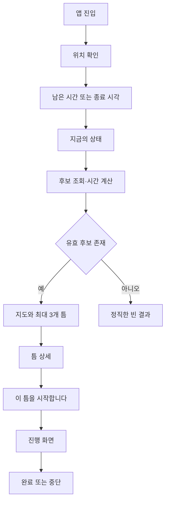

# 《틈》 모바일 프로토타입 구축·브랜드 디자인 시스템 핸드오프 가이드

> 문서 목적: 이 문서를 전달받은 구현 Agent가 별도의 기획 해석 없이 모바일 우선 웹 프로토타입을 설계·개발·검증할 수 있도록 제품 원칙, UX, 브랜드, 데이터, Node.js API, Gemini 연계, 추천 로직, 테스트와 완료 기준을 한 번에 정의한다.

---

## 0. 구현 Agent에게 주는 최상위 지시

당신은 《틈》의 수석 제품 디자이너이자 풀스택 엔지니어다. 아래 명세를 기준으로 모바일 우선 PWA 프로토타입을 구현하라.

구현 우선순위는 다음과 같다.

1. **시간 안에 완결되는 경험**을 정확히 계산한다.
2. 서울시 API의 실제 데이터와 실패 상태를 투명하게 처리한다.
3. 사용자가 30초 안에 하나의 제안을 선택할 수 있게 한다.
4. 브랜드의 조용한 편집 감각을 유지한다.
5. Gemini는 문장을 편집하되 사실을 만들지 못하게 한다.

명세에 없는 기능을 임의로 추가하지 않는다. 특히 로그인, 결제, 소셜 피드, 별점, 리뷰, 광고, 채팅형 인터페이스, 관리자 대시보드는 1차 프로토타입 범위 밖이다.

---

## 1. 제품의 단 하나의 명제

> 우리는 장소를 추천하는 것이 아니라 도시에서 사라지는 **시간의 틈**을 설계한다.

기존 지도는 “어디로 갈 것인가?”에서 출발한다. 《틈》은 “지금 몇 분이 남았는가?”에서 출발한다.

### 제품 한 문장

> 《틈》은 남은 시간과 현재 위치를 바탕으로, 그 시간 안에 이동·경험·복귀가 완결되는 서울의 경험을 제안하는 무료 모바일 지도다.

### 고객에게 보이는 문장

> **남는 시간을, 살아본 시간으로.**

### 초기 행동 변화

> 일주일에 한 번, 곧장 집에 가지 않는다.

### 경쟁 상대

경쟁자는 네이버지도나 카카오맵이 아니다. 사용자가 아무 결정도 하지 않고 **그냥 집에 가는 행동**이다.

---

## 2. MVP 타깃과 사용 순간

### 최초 고객

- 광화문·시청·을지로 권역에서 근무하는 30~44세 직장인
- 평일 저녁 약속이 없는 날 곧장 귀가하는 사람
- 장소 정보보다 결정 에너지가 부족한 사람

### 최초 운영 맥락

- 화요일~목요일 17:30~21:00
- 현재 위치에서 도보 또는 대중교통 20분 이내
- 15분, 30분, 60분, 90분의 틈
- 혼자 사용하는 상황부터 시작

### 핵심 JTBD

> “다음 일정까지 시간이 조금 남았을 때 검색과 비교에 에너지를 쓰지 않고, 늦지 않게 끝낼 수 있는 좋은 경험 하나를 바로 선택하고 싶다.”

---

## 3. 범위

### 반드시 구현

- 모바일 위치 권한 요청 및 거부 대체 흐름
- 종료 시각 또는 남은 시간 입력
- 현재 상태 선택
- 지도와 최대 3개 추천 카드
- 추천별 이동·체류·복귀·안전여유 계산
- 서울시 실시간 도시데이터 조회
- 결정론적 필터링·점수화
- Gemini 기반 제목·한 문장·추천 이유 생성
- Gemini 실패 시 템플릿 문장 대체
- “이 틈을 시작합니다”, “완료”, “중단” 이벤트 기록
- 데이터 갱신 시각과 신뢰 상태 표시
- 로딩, 빈 결과, 권한 거부, API 장애 화면
- 모바일 PWA 기본 설정

### 구현하지 않음

- 회원가입·소셜 로그인
- 결제·예약
- 리뷰·별점·댓글
- 친구·팔로우·공유 피드
- 사용자 간 메시지
- 장소 광고·스폰서 노출
- 생성형 AI 자유대화창
- 서울 전역의 완전한 장소 검색
- 네이티브 앱 패키징

---

## 4. 경험 설계 원칙

### 4.1 시간 우선

장소명보다 남은 시간과 경험의 성격을 먼저 보여준다.

- 나쁜 예: `덕수궁`, `서울시립미술관`
- 좋은 예: `27분의 고요`, `43분의 발견`, `비를 피하는 38분`

### 4.2 완결성

추천 총시간은 아래를 모두 포함해야 한다.

```text
총 소요시간 = 출발 이동 + 현장 체류 + 다음 목적지 이동 + 안전여유
```

다음 목적지가 없으면 복귀시간은 선택 사항이지만, MVP에서는 현재 위치 또는 지정 목적지로 돌아오는 시간을 포함하는 보수적 계산을 기본값으로 한다.

### 4.3 선택지는 최대 3개

후보가 많아도 상위 3개만 보여준다. 추천 가능한 후보가 1개라면 1개만 보여준다. 좋은 후보가 없으면 억지 추천하지 않는다.

### 4.4 지도보다 결정

지도는 탐색 도구가 아니라 선택을 돕는 배경이다. 사용자가 핀을 무한 탐색하도록 만들지 않는다.

### 4.5 설명 가능성

각 추천에는 데이터로 검증된 이유가 최소 2개 있어야 한다.

예:

- 현재 혼잡도가 여유다.
- 다음 목적지까지 12분 안에 이동할 수 있다.
- 비 예보로 실내 코스를 우선했다.
- 예상 비용이 설정한 범위 이하다.

### 4.6 정직한 실패

조건에 맞는 경험이 없을 때 다음처럼 말한다.

> 지금은 서두르지 않는 편이 좋습니다. 이동 여유를 포함하면 안전하게 완결되는 틈을 찾지 못했습니다.

---

## 5. 핵심 사용자 흐름



### 5.1 온보딩

한 화면, 세 문장 이내로 끝낸다.

```text
틈
남는 시간을, 살아본 시간으로.
현재 위치와 남은 시간을 바탕으로 지금 가능한 서울을 제안합니다.
```

CTA: `나의 첫 틈 찾기`

### 5.2 입력

1. 현재 위치 또는 직접 지역 선택
2. `15분 / 30분 / 60분 / 90분 / 직접 입력`
3. 상태 선택
   - 비우고 싶어요
   - 걷고 싶어요
   - 새로운 것을 보고 싶어요
   - 잠시 머물고 싶어요

### 5.3 추천 결과

- 지도에는 최대 3개 마커
- 하단에는 스와이프 가능한 카드
- 첫 카드는 가장 높은 점수의 추천
- 지도 마커와 카드는 양방향 동기화

### 5.4 실행

버튼명은 `길찾기`가 아니라 `이 틈을 시작합니다`로 한다. 시작 후에는 다음 단계와 남은 시간을 단순하게 보여준다.

### 5.5 종료

- `잘 보냈어요`
- `중간에 그만뒀어요`

중단 이유는 한 번의 탭으로 수집한다.

- 시간이 부족했어요
- 생각보다 멀었어요
- 너무 붐볐어요
- 장소가 닫혀 있었어요
- 지금의 기분과 달랐어요

---

## 6. 정보 구조와 화면 명세

### S01. 스플래시

- 워드마크 `틈`
- 배경 `Tteum Ivory`
- 1초 이내 페이드

### S02. 홈/시간 입력

- 상단: 현재 시각과 지역
- 헤드라인: `지금 몇 분의 틈이 있나요?`
- 시간 칩 5개
- 하단 고정 CTA: `다음`

### S03. 상태 입력

- 헤드라인: `이 시간을 어떻게 보내고 싶나요?`
- 감정/행동 카드 4개
- 단일 선택

### S04. 추천 지도

- 상단: `당신에게 52분의 틈이 있습니다`
- 중앙: 저채도 지도
- 하단: 추천 카드 1~3개
- 카드 정보: 제목, 총시간, 도보/이동, 현재 상태, 비용, 유효시간

### S05. 틈 상세

- 경험 제목
- 편집 문장 한 줄
- 타임라인: 출발 → 체류 → 다음 목적지/복귀
- 추천 근거 2~3개
- 데이터 기준 시각
- CTA: `이 틈을 시작합니다`

### S06. 진행

- 현재 단계
- 남은 전체 시간
- 다음 이동 시각
- 외부 지도 열기 링크
- `완료`, `중단`

### S07. 회고

- `이 시간을 잘 보냈나요?`
- 3단계 응답: 아쉬움 / 괜찮음 / 다시 하고 싶음
- 월간 회수 시간 안내는 로컬 데이터로 계산

### 필수 상태 화면

- 위치 권한 거부
- 서울시 API 지연/장애
- Gemini 장애
- 네트워크 오프라인
- 후보 없음
- 데이터가 오래됨

---

## 7. 브랜드 아이덴티티

### 브랜드 디자인 정의

> **도시적 시간의 여백 — Temporal Editorial Minimalism**

복잡한 서울의 데이터를 조용하고 인간적인 시간으로 편집한다. 독립서점의 온도, 잘 편집된 잡지의 질서, 도시 도구의 정밀함이 함께 있어야 한다.

### 브랜드 성격

- Quiet: 시끄럽게 유혹하지 않는다.
- Urban: 목가적 힐링이 아니라 서울의 결을 다룬다.
- Timely: 장소보다 지금의 조건을 정확히 읽는다.
- Editorial: 정보를 나열하지 않고 선택하여 맥락을 만든다.
- Trustworthy: AI가 아니라 검증된 데이터가 사실을 결정한다.

### 슬로건

- 주 슬로건: `남는 시간을, 살아본 시간으로.`
- 보조 슬로건: `집으로 가기 전, 서울을 한 번 더.`

### 보이스 원칙

- 짧고 조용하다.
- 명령하지 않고 제안한다.
- 감상적인 수사를 남발하지 않는다.
- 데이터 숫자를 사람의 언어로 번역한다.
- 불확실하면 단정하지 않는다.

---

## 8. 컬러 시스템

### 기본 팔레트

| Token | HEX | 용도 |
|---|---:|---|
| `--color-ivory` | `#F4F1E9` | 앱 기본 배경 |
| `--color-paper` | `#FAF8F3` | 카드·시트 배경 |
| `--color-ink` | `#202522` | 기본 텍스트 |
| `--color-ink-muted` | `#626A65` | 보조 텍스트 |
| `--color-dusk` | `#526779` | 브랜드·지도·정보 강조 |
| `--color-sage` | `#A9B4A3` | 공원·여유·긍정 상태 |
| `--color-coral` | `#E46F5D` | 현재 위치·CTA·유효시간 경고 |
| `--color-mist` | `#D9DDDA` | 구분선·비활성 |
| `--color-night` | `#151B1A` | 야간 배경 |
| `--color-danger` | `#B24E45` | 오류·중단 위험 |

### 사용 비율

- 아이보리·페이퍼 70%
- 잉크 15%
- 더스크·세이지 10%
- 코럴 5%

코럴은 장식이 아니다. `지금 행동할 수 있음`, `현재 위치`, `곧 닫힘`에만 사용한다.

### 접근성

- 본문 텍스트 대비는 WCAG AA 이상을 목표로 한다.
- 색상만으로 혼잡도나 상태를 전달하지 않는다.
- `여유`, `보통`, `붐빔` 텍스트와 아이콘을 함께 사용한다.

### CSS 토큰 예시

```css
:root {
  --color-ivory: #f4f1e9;
  --color-paper: #faf8f3;
  --color-ink: #202522;
  --color-ink-muted: #626a65;
  --color-dusk: #526779;
  --color-sage: #a9b4a3;
  --color-coral: #e46f5d;
  --color-mist: #d9ddda;
  --color-night: #151b1a;
  --color-danger: #b24e45;
}
```

---

## 9. 타이포그래피·간격·형태

### 폰트

- UI·수치: `Pretendard Variable`, fallback `system-ui, sans-serif`
- 경험 제목·편집 문장: `MaruBuri`, fallback `serif`

숫자와 시간은 산세리프로 정확하게, 경험 문장은 세리프로 인간적으로 표현한다.

### 타입 스케일

| Token | 크기/행간 | 용도 |
|---|---|---|
| Display | `36/44`, 600 | 남은 시간 |
| H1 | `28/36`, 600 | 화면 제목 |
| H2 Serif | `24/34`, 500 | 경험 제목 |
| Body | `16/25`, 400 | 본문 |
| Meta | `13/19`, 500 | 시간·거리·갱신 시각 |
| Caption | `12/17`, 400 | 출처·보조 설명 |

### 간격

4px 기반 시스템: `4, 8, 12, 16, 24, 32, 48, 64`.

### 반경

- 카드 20px
- 버튼 16px
- 칩 999px
- 지도 하단 시트 상단 28px

### 그림자

강한 그림자를 피한다.

```css
--shadow-sheet: 0 -8px 32px rgb(32 37 34 / 0.08);
--shadow-card: 0 8px 24px rgb(32 37 34 / 0.06);
```

### 모션

- 기본 전환 220~320ms
- 지도 마커는 튀지 않고 240ms 페이드·스케일
- 시간 영역은 500ms 동안 천천히 확장
- `prefers-reduced-motion` 존중

---

## 10. 로고·아이콘·사진

### 로고

- 한글 `틈` 워드마크 중심
- 글자 내부 또는 글자 사이에 의도적인 세로 여백
- 시계, 모래시계, 지도 핀을 직접 상징으로 사용하지 않는다.
- 흑백에서도 작동해야 한다.

### 아이콘

- 1.5px 선형 아이콘
- 둥글지만 유아적이지 않게
- 시간, 걷기, 실내, 비용, 혼잡, 날씨 6개를 우선 제작

### 사진

- 사람이 없거나 1~2명만 등장
- 늦은 오후의 빛, 긴 그림자, 젖은 도로, 창에 비친 서울
- 관광 홍보물 같은 고채도·초광각 사진 금지
- 장소 대표사진이 없으면 무리하게 생성하지 않고 지도와 문장만 사용

---

## 11. UI 카피 사전

| 일반 표현 | 《틈》 표현 |
|---|---|
| 주변 장소 검색 | 지금 몇 분의 틈이 있나요? |
| 추천 장소 | 오늘 가능한 시간 |
| 길찾기 | 이 틈을 시작합니다 |
| 영업 종료 예정 | 이 틈은 28분 후 닫힙니다 |
| 혼잡도 낮음 | 지금은 천천히 머물 수 있습니다 |
| 즐겨찾기 | 다음 틈에 남겨두기 |
| 방문 완료 | 이 시간을 잘 보냈나요? |
| 이용 기록 | 내가 되찾은 시간 |

---

## 12. 권장 기술 스택

### 프런트엔드

- React + TypeScript + Vite
- React Router
- TanStack Query
- Zustand 또는 React Context
- Leaflet + OpenStreetMap 타일: 로컬 프로토타입에만 사용
- CSS Modules 또는 단순 CSS variables
- Vite PWA plugin

상용 공개 시에는 OSM 공개 타일의 이용정책과 트래픽 제한을 검토하고, 정식 지도 사업자 또는 자체 타일 제공자로 교체한다.

### 백엔드

- Node.js 20 이상
- TypeScript
- Fastify 권장, Express도 허용
- Zod: 요청·응답·외부 API 검증
- pino: 구조화 로그
- SQLite: 프로토타입 이벤트 저장
- 향후 PostgreSQL + PostGIS로 교체 가능하게 repository 계층 분리

### 테스트

- Vitest
- React Testing Library
- Playwright 모바일 뷰포트
- 외부 API는 fixture와 mock 사용

---

## 13. 권장 저장소 구조

```text
tteum/
├─ apps/
│  ├─ web/
│  │  ├─ src/
│  │  │  ├─ components/
│  │  │  ├─ screens/
│  │  │  ├─ features/recommendation/
│  │  │  ├─ features/session/
│  │  │  ├─ lib/
│  │  │  ├─ styles/
│  │  │  └─ main.tsx
│  │  └─ public/
│  └─ api/
│     ├─ src/
│     │  ├─ routes/
│     │  ├─ adapters/seoul/
│     │  ├─ adapters/gemini/
│     │  ├─ domain/recommendation/
│     │  ├─ repositories/
│     │  ├─ fixtures/
│     │  └─ server.ts
├─ packages/
│  ├─ contracts/
│  └─ design-tokens/
├─ docs/
├─ .env.example
├─ package.json
└─ README.md
```

---

## 14. 보안과 환경변수

### 절대 원칙

- `SEOUL_API_KEY`, `GEMINI_API_KEY`를 프런트 코드에 넣지 않는다.
- 브라우저가 서울시나 Gemini API를 직접 호출하지 않는다.
- 모든 외부 호출은 Node 서버를 통과한다.
- 로그에 키, 원문 위치좌표, Gemini 전체 프롬프트를 남기지 않는다.
- `.env`는 Git에 커밋하지 않는다.

### `.env.example`

```dotenv
NODE_ENV=development
PORT=3001
WEB_ORIGIN=http://localhost:5173

SEOUL_API_KEY=replace_me
SEOUL_API_BASE_URL=http://openapi.seoul.go.kr:8088
SEOUL_CITYDATA_SERVICE=citydata

GEMINI_API_KEY=replace_me
GEMINI_MODEL=replace_with_free_tier_model_available_in_ai_studio
GEMINI_ENABLED=true

CACHE_CITYDATA_SECONDS=180
CACHE_EVENTS_SECONDS=21600
REQUEST_TIMEOUT_MS=8000
```

Gemini 무료 등급의 모델·요청 한도는 계정과 시점에 따라 달라질 수 있다. 모델명을 코드에 고정하지 말고 `GEMINI_MODEL`로 관리하며, 현재 사용 가능한 무료 모델은 AI Studio에서 확인한다.

---

## 15. 서울시 Open API 연계

### 기본 호출 형식

```text
{BASE_URL}/{KEY}/{TYPE}/{SERVICE}/{START_INDEX}/{END_INDEX}/{ARGUMENTS...}
```

실시간 도시데이터 예시:

```text
http://openapi.seoul.go.kr:8088/{SEOUL_API_KEY}/json/citydata/1/5/{AREA_NAME}
```

주의:

- 서비스명은 대소문자를 구분할 수 있다.
- 장소명은 반드시 `encodeURIComponent` 처리한다.
- 실시간 도시데이터는 한 번에 한 장소 호출을 기본으로 본다.
- API마다 응답 루트 객체명이 다를 수 있으므로 어댑터에서 정규화한다.
- HTTP 200이어도 응답 내부 `RESULT.CODE`가 오류일 수 있다.
- 공식 안내상 한 번에 최대 1,000건까지 요청하며, 실시간 지하철 API는 별도 일일 요청 제한이 안내되어 있다.

### 서울시 어댑터 인터페이스

```ts
export interface SeoulCitySnapshot {
  areaCode?: string;
  areaName: string;
  capturedAt: string;
  population: {
    level: "relaxed" | "normal" | "busy" | "very_busy" | "unknown";
    min?: number;
    max?: number;
    message?: string;
  };
  weather?: {
    temperatureC?: number;
    precipitationType?: string;
    precipitationMessage?: string;
    pm25?: number;
    pm10?: number;
  };
  transit?: {
    subway?: unknown[];
    bus?: unknown[];
  };
  bikes?: unknown[];
  parking?: unknown[];
  events: NormalizedEvent[];
  source: "seoul-citydata";
  stale: boolean;
}
```

원본 필드명을 프런트에서 직접 사용하지 않는다. `adapters/seoul`에서 도메인 모델로 변환한다. 실제 키 이름은 발급받은 API의 현재 샘플 응답과 공식 매뉴얼을 기준으로 fixture를 만든 후 확정한다.

### 캐시 전략

| 데이터 | 권장 TTL |
|---|---:|
| 실시간 인구·교통 | 3분 |
| 날씨·대기 | 5~10분 |
| 문화행사 | 6시간 |
| 장소 메타데이터 | 24시간 |
| 121개 장소 목록 | 배포 시 정적 번들 + 주기적 갱신 |

### 장애 처리

- 서울시 API timeout: 8초
- 1회만 지수 백오프 재시도
- 캐시가 있으면 `stale: true`로 반환
- 캐시도 없으면 fixture를 자동으로 실제 데이터처럼 표시하지 않는다.
- 데모 fixture 사용 시 화면에 `데모 데이터` 라벨을 명확히 표시한다.

---

## 16. 장소·경험 데이터 모델

서울시 실시간 데이터만으로 모든 장소의 체류시간·비용·감정 태그를 알 수 없다. MVP에서는 검증된 큐레이션 데이터 30개를 별도 seed로 관리한다.

```ts
export interface PlaceSeed {
  id: string;
  name: string;
  areaName: string;
  latitude: number;
  longitude: number;
  type: "walk" | "park" | "library" | "exhibition" | "view" | "cafe";
  moods: Array<"empty" | "walk" | "discover" | "stay">;
  indoor: boolean;
  minStayMinutes: number;
  idealStayMinutes: number;
  maxStayMinutes: number;
  estimatedCostWon: number;
  openTime?: string;
  closeTime?: string;
  closedDays?: string[];
  verifiedAt: string;
  sourceUrl?: string;
  accessibility?: {
    wheelchair?: boolean;
    toilet?: boolean;
    seating?: boolean;
  };
}
```

AI가 seed에 없는 장소를 추가해서는 안 된다. 장소 추가는 운영자가 출처와 검증일을 기록한 뒤 수행한다.

---

## 17. 시간 계산

### MVP 이동시간

정식 길찾기 API가 없다면 다음 단계로 구현한다.

1. 위·경도 간 Haversine 거리 계산
2. 도보 우회계수 `1.25`
3. 평균 도보속도 `75m/min`
4. 횡단보도·엘리베이터 등을 위한 고정 버퍼 `3분`

```text
estimatedWalkingMinutes = ceil(
  haversineMeters × 1.25 / 75
) + 3
```

이는 프로토타입 추정치임을 코드와 UI에 명시한다. 실제 서비스 전환 전에는 경로 기반 도보시간 API로 교체한다.

### 안전여유

```text
safetyBuffer = max(8분, 전체 가용시간의 12%)
```

### 가용 체류시간

```text
availableStay = gapMinutes - outbound - returnOrNext - safetyBuffer
```

`availableStay < place.minStayMinutes`이면 후보에서 제거한다.

---

## 18. 추천 엔진

추천의 사실 판단과 순위는 Node 코드가 맡는다. Gemini가 순위를 정하지 않는다.

### 하드 필터

- 운영시간 내에 완결 불가
- 이동·복귀·여유 포함 시 시간 초과
- 좌표 없음
- 데이터 검증일이 지나치게 오래됨
- 폭우·미세먼지 등 환경 조건과 실외 장소 충돌
- 혼잡도 `very_busy`
- 사용자 예산 초과

### 점수

모든 하위 점수는 0~1로 정규화한다.

```text
score =
  0.30 × contextFit
+ 0.25 × feasibility
+ 0.20 × comfort
+ 0.15 × novelty
+ 0.10 × budgetFit
```

감점:

```text
finalScore = score
  - crowdPenalty
  - travelFatiguePenalty
  - staleDataPenalty
```

### 동률 규칙

1. 예상시간 초과 위험이 낮은 후보
2. 더 최근에 검증된 후보
3. 더 낮은 혼잡도
4. 더 짧은 이동거리

### 반환

- 상위 3개만 반환
- 각 후보에는 `facts`, `risks`, `calculation` 포함
- 프런트용 문장은 Gemini 또는 fallback formatter가 생성

---

## 19. Gemini API 역할

### 허용

- 검증된 후보에 경험 제목 붙이기
- 데이터 근거를 자연스러운 한 문장으로 편집
- 사용자의 상태와 시간에 맞는 짧은 소개문 생성
- 기존 장소 설명을 정해진 분위기 태그로 분류

### 금지

- 장소·행사·운영시간·가격·좌표 생성
- 실시간 혼잡도 추측
- 이동시간 계산
- 추천 순위 결정
- API에 없는 사실 보강
- 사용자 위치 원문이나 API 키 출력

### 구조화 출력 스키마

```ts
const narrationSchema = {
  type: "object",
  properties: {
    title: { type: "string", maxLength: 24 },
    line: { type: "string", maxLength: 80 },
    reasons: {
      type: "array",
      minItems: 2,
      maxItems: 3,
      items: { type: "string", maxLength: 60 }
    }
  },
  required: ["title", "line", "reasons"],
  additionalProperties: false
};
```

### 시스템 지시문

```text
당신은 모바일 서비스 《틈》의 에디터다.
《틈》은 남는 시간을 살아본 시간으로 바꾸는 서울의 시간 설계 지도다.

반드시 제공된 FACTS만 사용한다.
장소, 행사, 시간, 가격, 거리, 혼잡도, 날씨를 추측하거나 추가하지 않는다.
사실이 부족하면 과장하지 않고 중립적으로 쓴다.

문체는 조용하고 도시적이며 짧다.
관광 광고, 감탄사, 과도한 형용사, '힐링', '핫플', '인생샷', '완벽한'을 사용하지 않는다.
장소명보다 사용자가 얻게 될 시간의 성격을 제목으로 쓴다.

제목은 24자 이내, 소개문은 80자 이내다.
JSON 스키마를 정확히 준수한다.
```

### 입력 예시

```json
{
  "user_context": {
    "gap_minutes": 60,
    "mood": "empty",
    "current_time": "2026-09-12T18:12:00+09:00"
  },
  "facts": {
    "place_name": "덕수궁 돌담길",
    "outbound_minutes": 7,
    "stay_minutes": 31,
    "return_minutes": 12,
    "safety_buffer_minutes": 10,
    "crowd_level": "relaxed",
    "cost_won": 0
  }
}
```

### Node.js 호출 원칙

공식 `@google/genai` SDK를 사용한다. SDK와 API 표면은 업데이트될 수 있으므로 설치된 버전의 타입과 공식 문서를 우선한다. 구조화 JSON 출력을 사용하고 Zod로 다시 검증한다.

```ts
import { GoogleGenAI } from "@google/genai";

const ai = new GoogleGenAI({ apiKey: process.env.GEMINI_API_KEY });

// 설치된 SDK 버전의 공식 구조화 출력 방식을 적용한다.
// model은 반드시 process.env.GEMINI_MODEL에서 읽는다.
```

### 실패 대체

Gemini가 timeout, rate limit, schema 오류를 내면 추천 자체를 실패시키지 않는다.

```text
title = `${stayMinutes}분의 ${moodLabel}`
line = `${areaName}에서 지금 가능한 짧은 시간입니다.`
reasons = deterministicFacts.slice(0, 3)
```

---

## 20. 내부 API 계약

### `POST /api/recommendations`

요청:

```json
{
  "location": { "lat": 37.5663, "lng": 126.9779 },
  "gapMinutes": 60,
  "mood": "empty",
  "budgetWon": 10000,
  "destination": null,
  "now": "2026-09-12T18:12:00+09:00"
}
```

응답:

```json
{
  "requestId": "uuid",
  "generatedAt": "ISO-8601",
  "dataStatus": "live",
  "recommendations": [
    {
      "id": "place-id",
      "title": "31분의 고요",
      "line": "사람이 적은 돌담길을 천천히 걷고 돌아옵니다.",
      "place": {
        "name": "덕수궁 돌담길",
        "lat": 37.0,
        "lng": 126.0
      },
      "timeline": {
        "outboundMinutes": 7,
        "stayMinutes": 31,
        "returnMinutes": 12,
        "safetyBufferMinutes": 10,
        "totalMinutes": 60
      },
      "facts": ["현재 혼잡도 여유", "예상 비용 0원"],
      "validUntil": "ISO-8601",
      "score": 0.82,
      "sourceUpdatedAt": "ISO-8601"
    }
  ]
}
```

### 기타 라우트

- `GET /api/health`
- `GET /api/areas`
- `GET /api/seoul/city/:areaName`
- `POST /api/sessions/start`
- `POST /api/sessions/:id/complete`
- `POST /api/sessions/:id/abandon`

외부 API 원본 응답을 프런트에 그대로 전달하지 않는다.

---

## 21. 이벤트·분석 설계

로그인 없이 익명 세션 ID를 로컬에 저장한다. 원시 GPS는 기본적으로 저장하지 않고 약 100m 수준으로 반올림하거나 영역 ID로 변환한다.

### 이벤트

| 이벤트 | 필수 속성 |
|---|---|
| `gap_search_started` | gapMinutes, mood, areaId |
| `recommendations_shown` | count, dataStatus, latencyMs |
| `recommendation_opened` | recommendationId, rank |
| `gap_started` | recommendationId, predictedMinutes |
| `gap_completed` | actualMinutes, reflection |
| `gap_abandoned` | elapsedMinutes, reason |
| `empty_result_shown` | filterReasonSummary |

### 북극성 지표

> 한 달 동안 의미 있는 경험으로 전환된 틈의 총시간

### 보조 지표

- 입력 완료부터 선택까지 중앙값 30초 이하
- 추천 후 실제 시작률
- 예상시간 내 완주율
- 중단률과 중단 사유
- 4주 내 재사용률
- API 성공률과 추천 생성 지연

페이지뷰와 체류시간을 성공지표로 삼지 않는다. 앱 안에 오래 머무는 것은 오히려 실패일 수 있다.

---

## 22. 성능·신뢰성 기준

- 첫 콘텐츠 표시: 3G Fast 기준 2.5초 이내 목표
- 추천 응답: 캐시 hit 800ms 이내, miss 4초 이내 목표
- Gemini는 2.5초 이후 fallback 가능
- 위치 권한 거부 시 지역 선택으로 계속 진행
- 서울시 API 장애 시 stale 캐시 우선
- 추천 계산은 동일 입력에 대해 재현 가능해야 함
- API 오류는 사용자에게 공급자 이름이나 내부 스택을 노출하지 않음

---

## 23. 테스트 시나리오

### 단위 테스트

- 15분 틈에 20분 최소 체류 장소가 제외되는가
- 안전여유가 정확히 반영되는가
- 영업 종료 전 완결되지 않는 후보가 제외되는가
- `very_busy` 후보가 제외되는가
- 동일 점수일 때 동률 규칙이 적용되는가
- stale 데이터가 감점되는가
- Gemini JSON 오류 시 fallback이 작동하는가

### 통합 테스트

- 서울시 성공 응답 → 정규화 → 추천 생성
- 서울시 HTTP 200 + 내부 오류코드 처리
- 서울시 timeout + stale 캐시 처리
- Gemini rate limit + 템플릿 대체
- 잘못된 좌표·시간 요청 400 처리

### E2E 모바일

1. 위치 허용 → 60분 → 비우기 → 추천 확인 → 시작 → 완료
2. 위치 거부 → 광화문 직접 선택 → 추천 확인
3. 오프라인 → 설명 가능한 오류 화면
4. 후보 없음 → 억지 추천 없이 빈 결과
5. 320px 폭에서도 CTA와 카드가 잘리지 않음

---

## 24. 구현 순서

### Phase 0. 부트스트랩

- 모노레포와 TypeScript 설정
- web/api 개발 서버 동시 실행
- `.env.example`, lint, format, test 구성

### Phase 1. 디자인 기반

- 토큰, 폰트, 버튼, 칩, 카드, 하단 시트
- S02~S05 정적 화면
- 390×844 모바일 뷰포트 우선

### Phase 2. 결정론적 추천

- 30개 place seed
- 거리·시간·안전여유 계산
- 하드 필터와 점수
- fixture 기반 추천 API

### Phase 3. 서울시 연계

- citydata adapter
- 캐시·timeout·재시도
- 실제/오래됨/데모 상태 구분
- 공식 응답 fixture 저장

### Phase 4. Gemini 연계

- 구조화 출력
- Zod 검증
- 금칙어·길이 검사
- timeout·rate limit fallback

### Phase 5. 행동 기록

- 시작·완료·중단
- 익명 세션
- 월간 회수 시간

### Phase 6. QA

- Playwright 모바일 흐름
- 접근성
- 느린 네트워크와 API 장애
- 실제 기기 Safari/Chrome

---

## 25. 완료 정의

다음 조건을 모두 만족해야 프로토타입 완료로 본다.

- [ ] 모바일에서 위치 또는 지역 선택이 가능하다.
- [ ] 사용자가 3번 이내 입력으로 추천을 받는다.
- [ ] 한 번에 최대 3개만 노출된다.
- [ ] 모든 추천이 가용시간 안에 완결된다.
- [ ] 이동·체류·복귀·안전여유가 보인다.
- [ ] 서울시 API 키와 Gemini 키가 서버에만 존재한다.
- [ ] 서울시 원본 응답이 도메인 모델로 정규화된다.
- [ ] AI가 장소·운영시간·가격을 생성하지 못한다.
- [ ] Gemini가 실패해도 추천이 표시된다.
- [ ] live/stale/demo 데이터가 구분된다.
- [ ] 위치 거부·API 장애·후보 없음 화면이 있다.
- [ ] 시작·완료·중단 이벤트가 기록된다.
- [ ] 브랜드 토큰이 한 곳에서 관리된다.
- [ ] 핵심 단위·통합·E2E 테스트가 통과한다.
- [ ] README에 실행 방법과 환경변수가 설명되어 있다.

---

## 26. 구현 Agent가 절대 바꾸지 말아야 할 것

1. 《틈》은 장소 검색 서비스가 아니다.
2. 첫 질문은 장소가 아니라 시간이다.
3. 추천은 3개를 넘지 않는다.
4. AI는 사실과 순위를 결정하지 않는다.
5. 다음 일정에 늦을 가능성이 있으면 추천하지 않는다.
6. 좋은 후보가 없으면 빈 결과를 보여준다.
7. 무료 프로토타입의 목적은 광고가 아니라 행동 데이터와 반복 습관 검증이다.
8. 화면의 중심은 지도 자체가 아니라 “지금 가능한 하나의 시간”이다.

---

## 27. 구현 Agent에게 그대로 붙여 넣을 실행 프롬프트

```text
첨부된 《틈》 프로토타입 구축·브랜드 디자인 시스템 핸드오프 가이드를 단일 진실 공급원으로 사용하라.

React + TypeScript + Vite 모바일 PWA와 Node.js + TypeScript API 서버를 구현하라. 서울시 열린데이터광장 API와 Gemini API는 반드시 서버에서만 호출하고 키를 프런트에 노출하지 마라.

먼저 전체 구현계획과 파일 트리를 제시한 뒤 Phase 0부터 순서대로 구현하라. 각 Phase가 끝날 때:
1) 변경 파일,
2) 실행 방법,
3) 테스트 결과,
4) 남은 위험을 짧게 보고하라.

서울시 API의 실제 응답 구조를 확인하기 전에는 필드명을 추측해 고정하지 말고, 원본 fixture를 만든 다음 Zod 스키마와 정규화 어댑터를 작성하라.

추천 후보의 필터링, 시간 계산, 점수, 순위는 결정론적 TypeScript 코드로 구현하라. Gemini는 검증된 사실을 《틈》의 문체로 편집하는 데만 사용하라. Gemini 응답은 JSON Schema와 Zod로 검증하고 실패 시 템플릿 문장으로 대체하라.

명세 밖의 로그인, 결제, 리뷰, 별점, 소셜, 광고, 챗봇 기능은 추가하지 마라. 지도에 무수한 핀을 표시하지 말고 추천은 최대 3개만 제공하라.

최종적으로 모바일 390×844 기준 스크린샷, 테스트 결과, 환경변수 안내, 알려진 한계를 포함한 README를 완성하라.
```

---

## 28. 공식 참고자료

- 서울 열린데이터광장 Open API 소개: <https://data.seoul.go.kr/together/guide/useGuide.do>
- 서울 실시간 도시데이터 안내: <https://data.seoul.go.kr/dataVisual/seoul/guide.do>
- 서울시 실시간 도시데이터 데이터셋: <https://data.seoul.go.kr/dataList/OA-21285/F/1/datasetView.do>
- 서울 생활인구: <https://data.seoul.go.kr/dataVisual/seoul/seoulLivingPopulation.do>
- Gemini API 시작하기: <https://ai.google.dev/gemini-api/docs/get-started>
- Gemini 구조화 출력: <https://ai.google.dev/gemini-api/docs/structured-output>
- Gemini API 요청 한도: <https://ai.google.dev/gemini-api/docs/rate-limits>

> 문서 기준일: 2026-09-12. 외부 API의 모델명, 무료 등급, 응답 필드, 요청 제한은 변경될 수 있으므로 구현 시 공식 문서와 실제 샘플 응답을 다시 확인한다.

